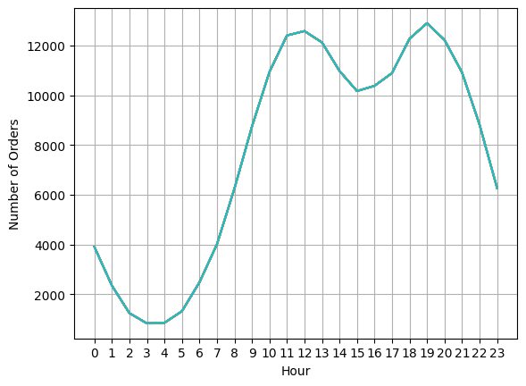

# sales-data-analysis
This repository contains code and resources for conducting sales data analysis. The purpose of this project is to explore, analyse, and derive insights from a dataset related to sales of different electronic products.
## Project Overview

**Fictional electronic store wants to create an annual sales report for 2022. For understanding their audience better and grow more sales**

###  Data Sources

sales-data-analysis: The primary dataset used for this analysis is stored in sales-data folder, containing csv files from January-December (2019).

  - Columns: Order ID, Product, Quantity Ordered, Price Each, Order Date, Purchase Address

### Tools

- Python: foundation for our project
- Pandas: for data processing & cleaning
- Matplotlib: for data visualization

## Approach for Data Analysis
1. **Ask**: ask questions & define problem
2. **Prepare**: prepare data by collecting & storing information
3. **Process**: process data by cleaning & checking information
4. **Analyse**: analyse data to find patterns & trends
5. **Share**: share data with audience
6. **Act**: act on data & use analysis results

### ASK
- What was the best month for sales? How much was earned that month?
- Which city had the highest number of sales?
- What time should we display advertisements to maximize likelihood of customer's buying product?
- What products are most often sold together?
- Which product sold the most? Why do you think it sold the most?

### PREPARE
- We received our dataset from github repo
- You can search for different datasets on github
- Link: [Github](https://github.com/)

### PROCESS
- Combined all csv files into one main csv file: **all_data.csv**
- Cleaned the null values (NaN) from all the columns of the dataset
- Converted columns to the correct data type
- Added column for month, sales & city

### ANALYSE
- Sorted & filtered data
- Used groupby to perform aggregate analysis
- Plotted bar charts and line graphs to visualize our results
- Provided full report with plots in *jupyter-notebook* as well as in *sales-data-analysis-dashboard.png*

### SHARE
- Least sales: January ($1,822,256), Most sales: December ($4,613,443)  
  
- San Francisco (CA) had the highest number of sales 
  
- We should advertise more during peak hours around 11 am (11) or 7 pm (19) 
  
- iPhone & lightning charging cable are 2 most sold products which are often bought together 
  
- Most Sold: AAA-Batteries (4 Pack) [Cheaper], Least Sold: LG Dryer [Costlier] 
  
  - **Hypothesis**: Quantity is inversely proportional to its price 
  - **Exception:** 
    Little bit of inconsistency in our insights for *Macbook & Thinkpad laptops* 
    Why? Because of certain demand of these laptops among the youth 
    

### ACT
- Target advertising efforts during peak hours and focus on popular products like iPhone and charging cables
- Analyze exceptions to price-quantity relationship and tailor strategies accordingly
